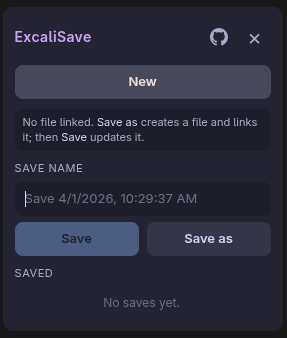

# ExcaliSave

Chrome extension for [excalidraw.com](https://excalidraw.com/): save named snapshots of your canvas to the browser, restore them later, and update the same “file” when you keep drawing—no server, no account.

**Status:** this is **v0**—barebones alpha. It is **not on the Chrome Web Store** yet; Google charges a one-time developer fee to publish, and this project hasn’t crossed that bridge. Load it unpacked from source if you want to try it.

---

## Screenshots

<p align="center">
  
</p>

---

## Why this exists

There are tons of drawing tools out there. **Excalidraw** is the one I keep coming back to—but one thing kept pushing me toward **eraser.io**: **saving** the way I want. Excalidraw’s own solution lives behind **premium**, and that’s not in my budget. So I built this extension: **for me first**, and for anyone else in the same boat—local saves, named snapshots, update-in-place instead of paying for a feature that feels essential.

---

## What it does

- Floating button on Excalidraw → open a small panel.
- **New / Save / Save as**, list of saved snapshots, **restore** or **delete**.
- Drag the launcher and the panel header so nothing sits on top of your work.
- Everything stays in **localStorage** on `excalidraw.com` (see limitations below).

---

## Install (unpacked)

```bash
git clone https://github.com/callmegautam/ExcaliSave.git
cd ExcaliSave
npm install
npm run build
```

Chrome → `chrome://extensions` → **Developer mode** → **Load unpacked** → choose the **`dist`** folder. Then open [excalidraw.com](https://excalidraw.com/).

To refresh icons after editing `public/logo.jpeg` (needs ImageMagick `magick`):

```bash
npm run generate-icons && npm run build
```

---

## Storage

Data lives in your browser on that site: Excalidraw’s `excalidraw` key plus `excaliSave_*` keys for snapshots and the “linked” save. It **does not sync** to the cloud. Huge drawings can hit **localStorage** limits; if **New** doesn’t fully clear the canvas, Excalidraw may still keep bits in **IndexedDB**—that’s on their side, not this extension.

---

## Author

**Gautam Suthar** — [iamgautamsuthar@outlook.com](mailto:iamgautamsuthar@outlook.com) · [@callmegautam](https://github.com/callmegautam) · [repo](https://github.com/callmegautam/ExcaliSave)

## License

[MIT](LICENSE)

---

<p align="center">
  <b>Made with</b> stubborn love for Excalidraw, mild grudge against paywalled saves, and enough <code>localStorage</code> to annoy a privacy tab.<br/>
  <!-- <i>(Chrome Web Store listing sold separately—wallet not included.)</i> -->
</p>
